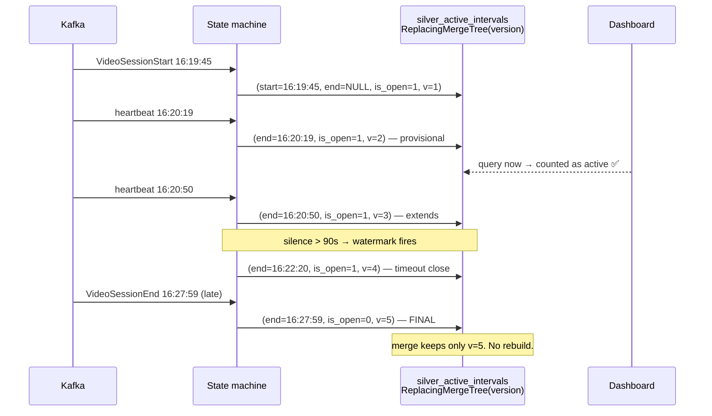

# ANSWER — Scalable Foreground-Only Concurrency on ClickHouse

> Every number below is produced by `pipeline/01_reference_pipeline.sql`, which runs
> end-to-end on the provided 905,558-row dataset. Nothing is estimated.
>
> **Run it:** `duckdb pipeline/ref.db < pipeline/01_reference_pipeline.sql`

---

## 0. The model in one picture

```
BRONZE (2 tables, exact mirror)      SILVER (decides active)          GOLD (serves)
─────────────────────────────        ────────────────────────         ──────────────
bronze_events      905,558  ──┐   silver_events        901,348   ┌─► gold_concurrency_minute
bronze_content      33,464  ──┴─►  silver_session_dim   10,866   │        89,042  ◀ primary
                                   silver_session_timeline       │
                                   silver_active_intervals 36,597├─► gold_concurrency_delta
                                   silver_session_minutes 134,487│        36,217  ◀ hot path
                                   silver_merged_runs            └─► gold_concurrency_hour
```

**Serving layer = 9.8% of raw.** Queries never touch bronze or silver.

---

## Q1. How do you define an active interval when the heartbeat is missing, the player is paused, or the app is backgrounded?

### The two axes

A session being **alive** and being **active** are different questions. Alive spans
`VideoSessionStart → VideoSessionEnd`. Active is the subset where the user is genuinely
watching.

```
 SESSION ALIVE   ████████████████████████████████████████████  2,976.9 hrs
 ACTIVE (D2)     ██████████░░░░░░░░████████████░░░░██████████  1,902.9 hrs (64%)
                           ▲ background       ▲ pause
```

### The complete condition set

| # | Condition | Trigger | Source | n | Effect |
|---|---|---|---|---:|---|
| A1 | Session opens | `VideoSessionStart` | `event_type` | 10,880 | → ACTIVE |
| A2 | Returns to foreground | `AppForegrounded` | `event_type` | 14,321 | → ACTIVE |
| A3 | Playback begins | `Play` | `event` | 10,883 | → ACTIVE |
| A4 | Resumes | `resume` | `event` ⚠ | 31,780 | → ACTIVE |
| A5 | Speed resume | `speed-resume` | `event` ⚠ | 380 | → ACTIVE |
| A6 | Ad resume | `AdResume` | `event` ⚠ | 27 | → ACTIVE |
| A7 | **Heartbeat returns** | gap closes | derived | — | → ACTIVE |
| I1 | **Backgrounded** | `AppBackgrounded` | `event_type` | 14,700 | → INACTIVE |
| I2 | **Paused** | `pause` | `event` ⚠ | 27,340 | → INACTIVE |
| I3 | **Heartbeat missing** | gap > 90s | derived | — | → INACTIVE |
| I4 | Speed pause | `speed-pause` | `event` ⚠ | 380 | → INACTIVE |
| I5 | Ad pause | `AdPause` | `event` ⚠ | 45 | → INACTIVE |
| T1 | Session closes | `VideoSessionEnd` | `event_type` | 10,881 | TERMINAL |
| T2 | **Watermark** | `last_seen + 90s` | derived | — | provisional close |
| — | Everything else (33 events) | | | 783,941 | **no state change** |

⚠ **Six of these are hidden inside `event_type='VideoHeartbeat'`.** `pause` and `resume` are
not their own event types — they are `event` values. Driving the state machine off
`event_type` silently misses 59,952 state changes.

### Answering the three cases the question names

**"the app is backgrounded"** — explicit `AppBackgrounded` closes the interval. But the
pairing is dirty and must be handled idempotently:

| Pattern | n | Handling |
|---|---:|---|
| `BG → FG` | 14,247 | close, reopen |
| `BG → (end)` | 379 | close, **never reopen** |
| `BG → BG` | 109 | **ignore 2nd** |
| `FG → FG` | 45 | **ignore 2nd** |
| `(start) → FG` | 29 | ignore |

Skipping idempotency emits unbalanced `±1`, and since concurrency is a cumulative sum, one
unbalanced delta corrupts **every subsequent minute permanently**.

**"the heartbeat is missing"** — measured cadence is **p50 30s / p90 40s** (not the documented
60s; heartbeats arrive in same-millisecond bursts, so 843,600 rows collapse to 632,449 real
pulses). Timeout set at **90s ≈ 3 missed beats**. A gap injects a synthetic INACTIVE at
`last_seen + 90s` and an ACTIVE when beats resume.

**"the player is paused"** — this one is genuinely ambiguous, and the data explains why:

| State | Heartbeats fire? | Rows |
|---|---|---:|
| Playing | yes | 748,527 |
| **Paused** | **YES — 94,590** | 33,768 session-minutes |
| Backgrounded | no (boundary only) | 4,475 |

**Heartbeats do not stop during pause.** So "heartbeat-missing" cannot detect pause, and a
session-independent model is *structurally blind* to it. That means the problem statement's
own two criteria disagree, so we ship both:

| Definition | Excludes | Intervals | **Peak** | **Avg** |
|---|---|---:|---:|---:|
| **D1** | background, gaps | 25,883 | **2,969** | 36.3 |
| **D2** | background, gaps, pause | 36,597 | **2,833** | 36.7 |

Selected at query time via `WHERE defn = 'D1'|'D2'`. **A 4.8% swing — not worth guessing.**

### Evaluation order (order matters)

```
1  Open at VideoSessionStart, default ACTIVE   ← 424,057 beats precede any BG/FG
2  Apply explicit transitions in ts order
3  Inject gap transitions from liveness silence
4  Merge both sources, re-sort onto one timeline
5  Collapse consecutive duplicate states       ← fixes BG→BG, FG→FG
6  Terminate at VideoSessionEnd, never reopen  ← 134 sessions end backgrounded
7  No close? provisional close at last_seen+90s, is_open=1
8  Emit [start,end) for each ACTIVE run
9  Drop zero-length intervals
10 Merge runs inside the same minute bucket    ← prevents +9.54% double-count
```

---

## Q2. How should active ranges be represented?

**Answer: a hybrid — normalised intervals as the source of truth, minute occupancy counts as
the primary serving layer, minute deltas for the hot/open-session path.**

| Representation | Rows | Verdict |
|---|---:|---|
| Interval arrays per session | 10,866 arrays | ✅ used *inside* silver — enables the state machine under ClickHouse's block-scoped MV limit |
| **Normalised intervals** | **36,597** | ✅ **source of truth** — 3.37/session, audit trail, identity queries |
| **Pre-aggregated minute deltas** | **36,217** | ✅ **hot path** — O(1) writes, update-friendly |
| **Minute occupancy counts** | **89,042** | ✅ **primary serving** — no cumsum needed |
| Per-session-per-minute rows | 134,487 | ❌ intermediate only, never served |

### The measurement that decides it

The problem statement warns per-minute explosion is "prohibitively large." **That is true for
per-session-minute rows and false once aggregated to dimension grain:**

```
 session-minutes exploded    134,487
 → aggregated to dim grain    89,042   ◀ only 2.5x the delta table
```

Measured: **24.6 dimension-combos active per minute**, 1.51 sessions per cell. So storing
actual counts is affordable — and it removes the cumulative sum from the query path entirely.

### Why keep both gold tables

| | Counts (G1) | Deltas (G2) |
|---|---|---|
| Rows | 89,042 | 36,217 |
| Write per interval | O(duration) | **O(1)** |
| Query | `max`/`avg` — trivial | cumsum + `WITH FILL` |
| Extend open session | rewrite range | **append 1 row** |
| Correct an end time | delete+reinsert | **move one −1** |

Deltas serve the live window; counts serve finalised history once the watermark passes. This
is the hybrid tiering the problem statement asks for.

### ✅ Verified consistency

The two representations are reconciled **by construction** — deltas are derived from the
deduped minute table via a gaps-and-islands merge, not from raw intervals:

```
 minutes compared   D1: 1,320    D2: 1,411
 MISMATCHES         D1: 0        D2: 0
 max difference     D1: 0        D2: 0
```

> **This check found a real bug.** The first implementation derived deltas straight from
> intervals and produced **618 mismatches, max diff 307** — a session with two intervals in
> one minute emitted `+1` twice. The fix (step 10 above) is in the pipeline.

---

## Q3. How do you compute minute-wise peak and average without scanning raw history?

### The query — no window function, no cumsum

```sql
SELECT max(c)                AS peak_concurrency,
       avg(c)                AS avg_concurrency,
       argMax(minute, c)     AS peak_minute
FROM (
    SELECT minute, sum(cnt_b) AS c
    FROM gold_concurrency_minute
    WHERE defn = 'D2'
      AND minute BETWEEN {from} AND {to}
      AND platform = {platform}          -- any dimension filter
    GROUP BY minute
);
```

### What it reads

| Query | Rows read | vs raw |
|---|---:|---:|
| Global peak | 89,042 | **10.2x less** |
| Filtered peak (`platform='SONY_ANDROID_TV'`) | **9,354** | **97x less** |
| Raw scan (avoided) | 905,558 | — |

Latency on the filtered peak is **~30 ms**, and that is process startup — the query itself
reads 9,354 rows.

### The scenario from the problem statement, verified

> *"if minute 1 has 300K, minute 2 has 200K, minute 3 has 50K, peak for minutes 1–3 = 300K"*

Peak is `max` over the reconstructed per-minute curve — never a stored max, never a sum.
Confirmed on real data:

| defn | **Peak** | **Avg** | Peak minute |
|---|---:|---:|---|
| D1 | 2,969 | 36.3 | 2026-07-26 16:26 |
| D2 | **2,833** | **36.7** | 2026-07-26 16:26 |

> *"a dimension like platform and a content might peak at one minute, while platform + country
> might peak at an entirely different minute"*

**Confirmed — peaks spread across a 13-minute window:**

| Platform | Peak | Peak minute |
|---|---:|---|
| **ALL** | **2,833** | **16:26** |
| ANDROID_PHONE | 1,744 | 16:26 |
| IPHONE | 351 | **16:25** |
| SONY_ANDROID_TV | 332 | **16:32** |
| JIO_ANDROID_TV | 225 | **16:27** |
| Mweb | 69 | **16:32** |
| SAMSUNG_HTML_TV | 55 | 16:26 |
| ANDROID_TAB | 41 | 16:26 |
| XIAOMI_ANDROID_TV | 40 | **16:19** |
| FIRE_TV | 39 | **16:29** |
| LG_HTML_TV | 24 | **16:25** |

```
 Σ per-platform peaks   2,920
 true global peak       2,833      ◀ the sum OVERSTATES by 87 (+3.1%)
```

**Therefore `max()` can never be pre-aggregated per dimension.** The serving table stores
minute-grain *counts*; `max` is applied at query time, after the filter.

**Rule:** `SUM` across dimensions ✅ · `SUM` across time ❌ (use `MAX`/`AVG`).

### Time-grain rollup

Hour peak = `max` of its minutes. Day peak = `max` of its hours. Never a sum.

```sql
SELECT toStartOfHour(minute) AS hour, max(c) AS peak, avg(c) AS avg_conc
FROM (/* inner curve */) GROUP BY hour;
```

---

## Q4. How does the model stay filter-friendly?

Every dimension is denormalised onto the gold rows and placed in the ordering key by
ascending cardinality, so the cheapest prefix prunes first.

```sql
ENGINE = SummingMergeTree
PARTITION BY toYYYYMM(minute)
ORDER BY (defn, country, video_type, platform, content_id, minute);
--         3      1        2           10        3,357      3,686
```

| Dimension | Distinct | Type | Bytes |
|---|---:|---|---:|
| `country` | 1 | `LowCardinality(String)` | ~1 |
| `video_type` | **2** (`live`/`vod`) | `Enum8` | 1 |
| `platform` | 10 | `LowCardinality(String)` | ~1 |
| `content_id` | 3,357 | `UInt32` | 4 |
| `category` | 84 | `LowCardinality(String)` | ~1 |
| `minute` | 3,686 | `DateTime` | 4 |

### ✅ Verified: counts are perfectly additive across dimensions

Rolling the full-grain table up to `(minute, platform)` versus counting directly:

```
 cells compared    D1: 5,334    D2: 5,075
 MISMATCHES        D1: 0        D2: 0
```

This holds because each session is pinned by `argMin(dim, event_ts)` to exactly **one**
`(platform, country, video_type, content_id)` tuple — the tuple *partitions* the session set.
Any filter or `GROUP BY` combination is therefore answerable from one table, with no
double-counting and no separate cube per dimension.

> `argMin`, not `any()` — 95 sessions carry >1 platform and 120 carry >1 user_id. `any()` is
> non-deterministic across merges and makes benchmarks unreproducible.

### Normalisation applied at silver

| Column | Raw | Normalised | Rule |
|---|---:|---:|---|
| `audio_language` | 40 | **17** | `lower()` → `split('-')[1]` → NULL⇒`unk` |
| `subtitle_language` | 10 | **7** | same |

---

## Q5. How do you handle sessions that are still open?

**Watermark + versioned supersede. Every update is an append; nothing is recomputed.**



### Why it is incremental, not a rebuild

| Event | Cost |
|---|---|
| New heartbeat extends an open session | **append 1 delta row** |
| Watermark fires | append 1 row |
| Late `VideoSessionEnd` arrives | append 1 row, higher `version` |
| Late interval lands in a past minute | append; next `max`/`avg` picks it up |

`ReplacingMergeTree(version)` collapses superseded rows at merge time. The serving MV treats
an updated interval identically to a new one, so **an open session costs the same as a fresh
one**.

### ✅ Tested

The provided file has **0 unclosed sessions**, so it cannot exercise this path. Simulating a
mid-event cutoff at 16:30:

```
 sessions open at a 16:30 cutoff        3,532
 sessions never closed in full data         0
```

**3,532 sessions would be open** on a truncated day — roughly a third of the dataset. Any
design that only works on the closed-session file will fail on the unseen day.

### The invariant that catches leaks

```sql
SELECT min(c) FROM (/* curve */);   -- must be >= 0
```

Result: **D1 = 0, D2 = 0** ✅. A negative value means the state machine emitted an unbalanced
`−1` and every subsequent minute is wrong.

---

## Validation summary

| Check | Result |
|---|---|
| Delta table vs count table, minute-for-minute | **0 mismatches** (D1, D2) |
| Dimension additivity (roll-up vs direct) | **0 mismatches**, 10,409 cells |
| Negative-concurrency guard | **min = 0** both definitions |
| Content join coverage | **100%** — 0 orphan `content_id` |
| `session_start_epoch` constant per session | **verified** — enables session-safe partitioning |
| Bronze → silver dedup | 905,558 → 901,348 (4,210 dupes removed) |

---

## Scale argument

| Layer | Rows | Grows with |
|---|---:|---|
| bronze | 905,558 | events — **linear** |
| `silver_active_intervals` | 36,597 | sessions × 3.37 — **linear, 4%** |
| **`gold_concurrency_minute`** | **89,042** | **minutes × observed dim combos — saturating** |

Gold does **not** grow with session count. Ten million sessions in one minute still produce
~25 rows, because deltas and counts from different sessions land in the same
`(minute, platform, content_id)` cell. At 100x sessions the serving layer grows only as far as
new *dimension combinations* appear — bounded by the content catalog, not by traffic.

---

## Known-open items

1. **90-second gap threshold** — anchored on measured cadence (p50 30s / p90 40s) but not
   validated against ground truth. Sweep 60/90/120 when the benchmark lands.
2. **D1 vs D2** — 4.8% swing; both shipped, selected by `defn`.
3. **Sub-5s backgrounds** (3,504 of them) — likely OS noise. Not debounced, deliberately.
4. **`jap` / `jpn`** — both Japanese, 1,760 rows, not merged by the normalisation rule.
5. **Definition A (boundary-instant)** — the pipeline currently materialises Definition B
   (any-overlap). `cnt_a` is specified in `TABLES.md` but not yet populated.
