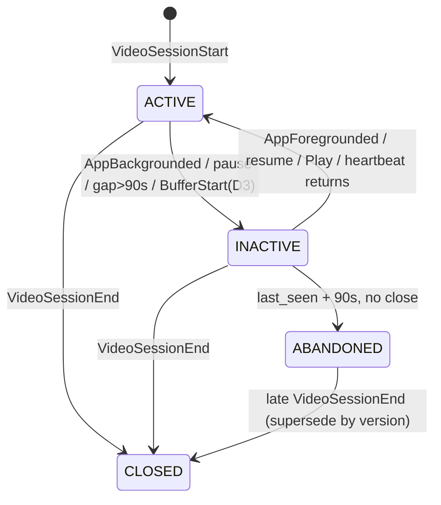

# Active vs Inactive — The Complete Condition Reference

> One page. Every condition that makes a session **count** or **not count** toward
> concurrency, and which table decides it.
> All counts measured from `ch-hackathon-raw-data.csv` (905,558 rows / 10,866 sessions).

---

## 1. The two axes — these are NOT the same question

```
                    IS THE SESSION ALIVE?              IS IT ACTIVE RIGHT NOW?
                    (lifecycle)                        (activity)
                    ─────────────────────              ───────────────────────
    opened by       VideoSessionStart                  foreground AND playing
    closed by       VideoSessionEnd / watermark        background OR pause OR gap
    lives in        silver_session_dim                 silver_active_intervals
    granularity     1 row per session                  ~3.31 rows per session
```

A session is **alive** for its whole wallclock span, but **active** only part of it.

```
 SESSION ALIVE   ████████████████████████████████████████████  2,976.9 hrs
 ACTIVE (D2)     ██████████░░░░░░░░████████████░░░░██████████  1,902.9 hrs (64%)
                           ▲ background       ▲ pause
```

**Only ACTIVE time is counted in concurrency.** Alive-but-inactive is the 36% error the whole
problem exists to prevent.

---

## 2. The four states

| State | Alive? | Counted? | Meaning |
|---|:--:|:--:|---|
| `ACTIVE` | ✅ | **✅ YES** | foreground + playing → emits interval |
| `INACTIVE` | ✅ | ❌ no | backgrounded / paused / silent — session still open |
| `CLOSED` | ❌ | ❌ no | `VideoSessionEnd` seen — terminal |
| `ABANDONED` | ❓ | ❌ no | no close, watermark expired — provisional |



---

## 3. ALL conditions — the complete list

### 3.1 Conditions that make a session ACTIVE (open an interval)

| # | Trigger | Source column | n | Table that decides |
|---|---|---|---:|---|
| A1 | `VideoSessionStart` | `event_type` | 10,880 | `silver_session_timeline.transitions` |
| A2 | `AppForegrounded` | `event_type` | 14,321 | `silver_session_timeline.transitions` |
| A3 | `Play` | `event` | 10,883 | `silver_session_timeline.transitions` |
| A4 | `resume` | `event` ⚠ | 31,780 | `silver_session_timeline.transitions` |
| A5 | `speed-resume` | `event` ⚠ | 380 | `silver_session_timeline.transitions` |
| A6 | `AdResume` | `event` ⚠ | 27 | `silver_session_timeline.transitions` |
| A7 | Heartbeat returns after gap | derived | — | `silver_session_timeline.live_minutes` |
| A8 | `BufferEnd` *(D3 only)* | `event` ⚠ | 66,289 | `silver_session_timeline.transitions` |

⚠ = hidden inside `event_type='VideoHeartbeat'`. **Filtering on `event_type` misses these.**

### 3.2 Conditions that make a session INACTIVE (close an interval)

| # | Trigger | Source | n | Time removed | Table |
|---|---|---|---:|---:|---|
| I1 | `AppBackgrounded` | `event_type` | 14,700 | **−915 hrs** | `…timeline.transitions` |
| I2 | `pause` | `event` ⚠ | 27,340 | **−159 hrs** | `…timeline.transitions` |
| I3 | Heartbeat gap > 90s | derived | 2,320 gaps >300s | inferred | `…timeline.live_minutes` |
| I4 | `speed-pause` | `event` ⚠ | 380 | −0.22 hrs | `…timeline.transitions` |
| I5 | `AdPause` | `event` ⚠ | 45 | −0.13 hrs | `…timeline.transitions` |
| I6 | `BufferStart` *(D3 only)* | `event` ⚠ | 66,641 | −10.1 hrs | `…timeline.transitions` |

### 3.3 Conditions that END the session (terminal)

| # | Trigger | n | Table |
|---|---|---:|---|
| T1 | `VideoSessionEnd` | 10,881 | `silver_session_dim.has_close` |
| T2 | Watermark: `last_seen + 90s`, no close | 0 here / expected on unseen day | `silver_session_dim.last_seen` |

### 3.4 Conditions that change NOTHING (liveness only)

**33 events.** They prove the session is alive but do not alter activity state:
`network-activity` · `buffer-health` · `video-resize` · `video_forward` · `Seek` ·
`network-bandwidth` · `upshift` · `downshift` · `dropped-frames` · `video_rewind` ·
`network-change` · `AdSkipTrueView` · all `download_*` · `chromecast_*` · `go_live_click` ·
`golive` · `next_video_click` · `audio-language` · `subtitle-language` · `speed-change` ·
`preroll-disabled` · `video_quality_change` · `preview_watched` · `AdClick` ·
`AdBufferStart/End` · `premium_button_click` · **`VideoError`**

> **`VideoError` is NOT terminal.** 238/293 (81%) precede `VideoSessionEnd` within 5s, but
> **55 sessions keep playing**. Treating it as terminal truncates those 55.

**Validation:** for all 33, P(followed by `AppBackgrounded` ≤30s) is **≤0.5%**.
For `pause` it is **26.6%** — the only event that predicts disengagement.

---

## 4. Background ⇄ Foreground — all five patterns

`AppBackgrounded` = 14,700 but `AppForegrounded` = 14,321. **They do not pair cleanly.**

| Pattern | n | Meaning | Required handling |
|---|---:|---|---|
| ✅ `BG → FG` | 14,247 | normal | close interval, reopen |
| ⚠ `BG → (end)` | 379 | never returned (134 end while backgrounded) | close; **do NOT reopen** |
| ⚠ `BG → BG` | 109 | duplicate / missed FG | **ignore 2nd** — idempotent |
| ⚠ `FG → FG` | 45 | orphan foreground | **ignore 2nd** — idempotent |
| ⚠ `(start) → FG` | 29 | missing initial BG | ignore — already active |

> **The idempotency rule is not optional.** The 109 + 45 repeats emit unbalanced `+1`/`−1`.
> Because concurrency is a **cumulative sum**, one unbalanced delta shifts **every subsequent
> minute permanently** — not just one.
> Fix: `arrayFilter((x,i) -> i=1 OR x.2 != ev[i-1].2, ev, arrayEnumerate(ev))`

**Background durations:** p10 1.4s · **p50 35.1s** · p90 509s · max 39.6 hrs.
3,504 are under 5s (likely OS noise — debounce is an open question).

---

## 5. The pause trap — heartbeats do NOT stop

| Player state | Heartbeats fire? | Rows | Session-minutes |
|---|---|---:|---:|
| Playing | yes | 748,527 | — |
| **Paused** | **YES** | **94,590** | **33,768** |
| Backgrounded | no (boundary only) | 4,475 | 3,021 |

```
 BACKGROUND  ──►  heartbeats STOP      ✅ silence detects it
 PAUSE       ──►  heartbeats CONTINUE  ❌ silence CANNOT detect it
```

**Consequence:** a heartbeat-only (session-independent) model is **structurally blind to
pause**. It measures *"app in foreground"*; the state machine measures *"foreground AND
playing"*. They are complements, **not** cross-checks — do not treat agreement as validation.

---

## 6. The three definitions of ACTIVE

| | Excludes | Active hrs | **Peak** |
|---|---|---:|---:|
| naive | nothing | 2,976.9 | 3,543 |
| **D1** | background | 2,061.7 | **2,657** |
| **D2** | background + pause | 1,902.9 | **2,427** |
| **D3** | + buffering | 1,876.8 | **2,411** |

Problem statement supports **both** D1 (*"foreground-only"*, correctness criterion mentions
only background + heartbeat-missing) and D2 (*"…or the player is paused"*).
**Store all three via the `defn` column.**

---

## 7. Which table answers which question

| Question | Table | Engine |
|---|---|---|
| What raw events arrived? | `bronze_events` | `MergeTree` |
| Is this event a state change? | `silver_events.signal` | `ReplacingMergeTree` |
| What are this session's dimensions? | `silver_session_dim` | `AggregatingMergeTree` |
| Is the session still alive? | `silver_session_dim.has_close` / `.last_seen` | `AggregatingMergeTree` |
| What are the state transitions? | `silver_session_timeline.transitions` | `AggregatingMergeTree` |
| Was there a heartbeat gap? | `silver_session_timeline.live_minutes` | `AggregatingMergeTree` |
| **When was it ACTIVE?** | **`silver_active_intervals`** | `ReplacingMergeTree(version)` |
| Which minutes did it cover? | `silver_session_minutes` | `ReplacingMergeTree` |
| **How many concurrent at minute M?** | **`gold_concurrency_minute`** | `SummingMergeTree` |
| Hot / open-session updates | `gold_concurrency_delta` | `SummingMergeTree` |
| Hour & day grain | `gold_concurrency_hour` | `AggregatingMergeTree` |

### Evaluation order

```
 bronze_events
   └─► silver_events            signal = f(event, event_type)      ← condition source
         ├─► silver_session_dim       alive? dimensions?           ← T1, T2
         └─► silver_session_timeline  transitions + live_minutes   ← A1-A8, I1-I6
               └─► silver_active_intervals   ◀ ALL CONDITIONS APPLIED HERE
                     └─► silver_session_minutes   dedup per session-minute
                           └─► gold_concurrency_minute
```

---

## 8. Full evaluation order inside `silver_active_intervals`

Order matters — later rules override earlier ones.

| Step | Rule | Why this position |
|---|---|---|
| 1 | Open at `VideoSessionStart`, state = ACTIVE | 424,057 heartbeats precede any BG/FG — need a default |
| 2 | Apply explicit transitions (A1–A6, I1–I5) in timestamp order | primary signal |
| 3 | Inject gap transitions (I3 / A7) from `live_minutes` | secondary, inferred |
| 4 | Merge + re-sort both sources onto one timeline | gaps and events interleave |
| 5 | **Collapse consecutive duplicate states** | fixes `BG→BG`, `FG→FG` |
| 6 | Terminate at `VideoSessionEnd` — never reopen | 134 sessions end backgrounded |
| 7 | If no close: provisional close at `last_seen + 90s`, `is_open=1` | open sessions |
| 8 | Emit `[start, end)` for every ACTIVE run | intervals |
| 9 | Drop zero/negative-length intervals | same-ms events |
| 10 | Merge intervals < 1 bucket apart | prevents **+9.54%** double-count |

---

## 9. Edge cases that silently corrupt results

| # | Edge case | Measured | Consequence if missed |
|---|---|---:|---|
| E1 | `BG→BG` / `FG→FG` repeats | 109 / 45 | **permanent** cumsum drift |
| E2 | Two intervals in one minute | 13,068 | **+9.54%** inflation |
| E3 | Interval starts+ends in same minute | 14,310 (40%) | vanishes under Definition A |
| E4 | Duplicate `SessionStart`/`End` | 13 / 14 | double-counted sessions |
| E5 | Sessions ending backgrounded | 418 | wrongly reopened |
| E6 | Sessions spanning >1 day | 16 | dropped by date partitioning |
| E7 | Session with >1 platform / user | 95 / 120 | non-reproducible — use `argMin` |
| E8 | Missing minutes in sparse dims | FIRE_TV 2/60 | `avg` wrong (`max` safe) |
| E9 | `VideoError` treated as terminal | 55 sessions | truncated early |
| E10 | Overlapping sessions per user | 17,397 pairs / 61 users | user-level ≠ session-level |

---

## 10. Quick reference — is this minute counted?

```
  ┌─ Session opened?                    NO ──► not counted
  │  YES
  ├─ Session closed before this minute? YES ─► not counted
  │  NO
  ├─ App backgrounded?                  YES ─► not counted   (all definitions)
  │  NO
  ├─ Player paused?                     YES ─► not counted   (D2, D3 only)
  │  NO
  ├─ Heartbeat gap > 90s?               YES ─► not counted   (all definitions)
  │  NO
  ├─ Buffering?                         YES ─► not counted   (D3 only)
  │  NO
  └─────────────────────────────────────────► ✅ COUNTED
```

**Unresolved:** the 90s threshold is anchored on measured cadence (p50 30s / p90 40s) but is
**not validated against ground truth**. Sweep 60 / 90 / 120s before locking it.
