# SonyLIV Foreground-Only Concurrency — Click-a-thon 2026

> **What this is.** A ClickHouse pipeline that answers "how many people are watching right now?" — correctly excluding backgrounded and heartbeat-missing time — at a scale where per-minute explosion and raw-history rescans both collapse.
>
> **Read this file first.** It is the single entry point: architecture, every assumption behind the numbers, and what each table is for. Two companion docs go deeper on specific mechanics: [`PIPELINE_LOGIC.md`](PIPELINE_LOGIC.md) (full build rationale, every ClickHouse gotcha hit and fixed) and [`LLM_QUERY_GUIDE.md`](LLM_QUERY_GUIDE.md) (how a conversational layer should query this schema).
>
> **Problem statement:** [`SonyLiv/PROBLEM_STATEMENT.md`](SonyLiv/PROBLEM_STATEMENT.md)

---

## 1. Architecture — bronze → silver → gold, left to right

Every named ClickHouse object is its own node below — including the materialized views themselves, not just the tables — so it's explicit which object derives from which, and by what mechanism.

```mermaid
flowchart LR
    classDef tbl fill:#1f2937,stroke:#9ca3af,color:#fff,stroke-width:1px
    classDef mv fill:#7c2d12,stroke:#fb923c,color:#fff,stroke-width:1px
    classDef view fill:#1e3a5f,stroke:#60a5fa,color:#fff,stroke-width:1px

    subgraph BRONZE["BRONZE — Kafka to ClickPipes"]
        direction LR
        BE["bronze_events_raw<br/>SharedMergeTree"]:::tbl
        BC["bronze_content_raw<br/>SharedMergeTree"]:::tbl
    end

    subgraph SILVER["SILVER — the active-interval model"]
        direction LR
        MV1{{"mv_silver_session_state<br/>incremental MV, owns storage<br/>AggregatingMergeTree, POPULATE"}}:::mv
        SSC("silver_session_state_current<br/>VIEW, zero storage"):::view
        MV2{{"mv_silver_active_intervals<br/>refreshable MV<br/>REFRESH EVERY 15 SECOND"}}:::mv
        SAI["silver_active_intervals<br/>ReplacingMergeTree(version)"]:::tbl
    end

    subgraph GOLD["GOLD — the serving layer"]
        direction LR
        MV3{{"mv_gold_concurrency_minute<br/>refreshable MV<br/>DEPENDS ON mv_silver_active_intervals"}}:::mv
        G1["gold_concurrency_minute (G1)<br/>AggregatingMergeTree<br/>uniqExactState(session_id)"]:::tbl
        MV4{{"mv_gold_concurrency_delta<br/>refreshable MV<br/>DEPENDS ON mv_silver_active_intervals"}}:::mv
        G2["gold_concurrency_delta (G2)<br/>SummingMergeTree, no session_id"]:::tbl
    end

    BE -->|"① fires per event block, zero gap"| MV1
    BC -->|"joined in MV1's SELECT"| MV1
    MV1 -->|"② merges states on every read"| SSC
    SSC -->|"③ full window-fn algorithm, re-run every cycle"| MV2
    MV2 -->|"writes TO"| SAI
    SAI -->|"④ ARRAY JOIN range per interval"| MV3
    SAI -->|"④ same source, sequenced not clocked"| MV4
    MV3 -->|"writes TO"| G1
    MV4 -->|"writes TO"| G2
```

**No manual `INSERT ... SELECT` exists anywhere past bronze.** Every object from `mv_silver_session_state` onward is a materialized view or a plain view — never a hand-run INSERT. Two mechanisms, deliberately different:

| # | Mechanism | Gap | Why |
|---|---|---|---|
| ① | Incremental MV, owns its own storage, `POPULATE`-backfilled once | **Zero** | Per-session `AggregateFunction` states merge correctly across any number of blocks — no window function needed at this layer. |
| ②③④ | Refreshable MV, `REFRESH EVERY 15 SECOND`, chained by `DEPENDS ON` (not a separate wall-clock schedule) | **Bounded 15s** | The interval-cutting algorithm needs `lagInFrame`/`leadInFrame` over a session's *entire* transition history at once — structurally impossible for an incremental MV, which only ever sees one just-inserted block. This is the one accepted staleness window in the whole pipeline — see §2.7. `DEPENDS ON` guarantees gold never reads a half-refreshed interval set. |

---

## 2. Assumptions — what "active" means, and why

Everything downstream depends on these calls. Written so a reviewer who has never seen the dataset can audit each one against evidence, not intuition.

### 2.1 A session has two different questions attached to it

**Alive** ≠ **active**. Alive spans `VideoSessionStart → VideoSessionEnd`. Active is the subset where the viewer is genuinely present — foregrounded, heartbeating. Concurrency counts **active**, not alive. This is the entire point of the problem statement: *"overcounting backgrounded time is the failure mode this whole problem exists to prevent."*

### 2.2 What flips a session to ACTIVE

| Signal | Source column | Effect |
|---|---|---|
| `VideoSessionStart` | `event_type` | session opens, default ACTIVE |
| `AppForegrounded` | `event_type` | returns to foreground → ACTIVE |
| `Play` | `event` | playback begins → ACTIVE |
| Heartbeat resumes after a gap | inferred (see §2.4) | gap closes → ACTIVE |

### 2.3 What flips a session to INACTIVE

| Signal | Source column | Effect |
|---|---|---|
| `AppBackgrounded` | `event_type` | explicit background → INACTIVE |
| Heartbeat silence > 60s | inferred (see §2.4) | → INACTIVE |
| `VideoSessionEnd` | `event_type` | terminal — session never reopens |

### 2.4 Assumption: **pause is ACTIVE, not inactive**

`pause`, `resume`, `speed-pause`, `speed-resume`, `AdPause`, `AdResume` are **not their own `event_type`** — they're hidden as `event` values inside `event_type = 'VideoHeartbeat'`. We treat every one of them as **no state change** (if the session was active, it stays active through a pause).

**Why.** A paused viewer is still occupying a player slot, holding a CDN connection, and counting against ad/capacity footprint — they are concurrent in every operational sense the business cares about. The data itself supports this independently of that argument: **heartbeats keep firing during pause.**

| Player state | Heartbeats fire? | Evidence |
|---|---|---|
| Playing | yes | 748,527 heartbeat rows |
| **Paused** | **yes — 94,590 rows** | client keeps reporting; session is genuinely still alive |
| Backgrounded | no (only boundary artifacts) | 4,475 rows |

Silence means *gone*. Pause does not. A secondary "engaged-viewing" definition (pause = inactive) was built and validated as a diagnostic metric for content teams (peak 2,844 vs 2,958 primary on the reference dataset, both measured at the earlier `gap_ms=50000`; not yet re-measured at the current 60000) but is **not** the primary concurrency answer.

### 2.5 **60-second heartbeat-silence threshold — stated in the spec, not assumed**

`dataset_details.md` (data dictionary, `event_type` column — identical wording repeated verbatim in `unseen_data/spec.md`) states:

> "The heartbeat event type is a periodic event which is currently passed every 1 minute."

Read literally, this settles the question directly: if no heartbeat (or any other event) has arrived within 1 minute of the last one, the session is INACTIVE from that point until the next event arrives. `gap_ms = 60000` implements exactly that rule. This is **not** an assumption we made up — it's the dataset's own documented cadence, taken at face value.

**Cross-checked against the raw data (not the basis for the value, just a sanity check on it):** the actual dominant heartbeat spacing in the raw data is ~40s in both the original and unseen datasets, not 60s. Building gaps from heartbeat-to-heartbeat spacing only (not all events — an `AppBackgrounded` event's own timestamp is always a gap *endpoint*, never *inside* a gap, if gaps are built from all events; this is a real methodology fix, not a stylistic one) and checking `P(gap contains a real labelled AppBackgrounded)`:

| Gap length | P(gap contains a real background event) |
|---|---:|
| 40–41s (dominant cadence) | ~0.01–0.16% |
| 41–45s | jumps to double digits |
| **60s+** | **safely inside the high-probability zone in both datasets** |

So the spec's literal 60s does not contradict the data — it's simply more conservative than the tightest defensible value (~41s). **Sensitivity is low either way:** moving between 45s, 50s, and 60s changes peak concurrency by well under 1% on both the original and unseen datasets — this constant is not a source of meaningful disagreement, whichever end of the range you pick, but 60s is what we use because it's what the spec states.

### 2.6 Assumption: idempotent transition handling

Real event streams are dirty. We do not trust that `AppBackgrounded`/`AppForegrounded` always alternate cleanly:

| Pattern | Handling |
|---|---|
| `BG → FG` | close, then reopen (normal case) |
| `BG → (session end, no FG)` | close, **never reopen** |
| `BG → BG` (duplicate) | ignore the second |
| `FG → FG` (duplicate) | ignore the second |
| `(session start) → FG` immediately | ignore — already active |

Skipping this produces unbalanced `+1`/`-1` deltas, and because concurrency is a cumulative sum, **one unbalanced delta corrupts every subsequent minute permanently**. The fix is a dedup-by-state-change step before intervals are cut (`lagInFrame` comparison — keep a row only if its state differs from the previous row for that session).

### 2.7 Assumption: **a 15-second staleness window is acceptable for intervals and gold, and unavoidable given ClickHouse's own constraints**

The interval-detection algorithm needs `lagInFrame`/`leadInFrame` window functions over **all of a session's transitions at once** — a whole-history computation, not a per-event one. ClickHouse gives two mechanisms for automatic table population:

| Mechanism | Sees | Can run this algorithm? |
|---|---|---|
| Incremental MV | Only the just-inserted block | No — a window function over "all transitions" cannot execute on a fragment |
| Refreshable MV | The full result of a query, re-run on a schedule | Yes — reads the fully-merged session state and runs the complete algorithm each cycle |

We accept a **bounded 15-second staleness window** on `silver_active_intervals` and everything downstream of it, rather than either rescanning history on every dashboard query (too slow) or hand-running batch INSERTs (not automatic). `session_state` itself has **zero gap** — it's a true incremental MV, because per-session state accumulation (unlike interval-cutting) doesn't need a window function; `AggregateFunction` states merge correctly across any number of blocks.

### 2.8 Assumption: open sessions get a synthetic close (watermark), not indefinite growth

If a session has no `VideoSessionEnd` (`has_close = 0`), we emit a synthetic close at `last_seen_ms + 60s` and flag the interval `is_open = 1`. This gives every query a deterministic snapshot instead of an ever-growing open interval. When a real heartbeat or `VideoSessionEnd` arrives later, `ReplacingMergeTree(version)` collapses the provisional row in favor of the newer one — no rebuild, no rescan.

**This dataset has 0 open sessions** (every one of the 10,866 sessions closes cleanly) — the watermark path is dead code *here*, but load-bearing for the unseen day. A truncation experiment confirmed the scale this matters at: cutting the file mid-stream at an arbitrary point leaves roughly a third of sessions open.

### 2.9 Assumption: `content_id` pins to exactly one dimension tuple per session

A session is denormalized to one `(platform, country, video_type, content_id)` tuple via `argMin(dim, event_timestamp)` — pinned to the **earliest** event, not `any()`. 95 sessions in this dataset carry more than one platform value across their lifetime (device switch mid-session); `argMin` makes the choice deterministic and reproducible across merges, where `any()` would not be.

### 2.10 Assumption: `video_type = ''` is a data-quality gap, normalized to `'unk'`

`bronze_content_raw` (the content catalog) has 1,089 rows where `video_type` is an **empty string**, not `NULL` — confirmed by checking the catalog directly and confirming **zero** join misses between events and catalog (every `content_id` in events matches a catalog row). We normalize empty string (not just `NULL`) to `'unk'`: `coalesce(nullIf(video_type, ''), 'unk')`. Currently 3,691 of 94,464 gold rows (≈3.9%) carry `unk`.

### 2.11 Assumption: both concurrency and reach are legitimate answers, so both are computed

"Peak concurrency" is not mathematically unique until you fix what happens at a minute boundary. We compute and store both, letting the caller (human or LLM) pick deliberately:

| | `cnt_a` — **concurrency** | `cnt_b` — **reach** |
|---|---|---|
| Definition | Session's interval **fully covers** the minute instant | Session **touches** the minute at all |
| Boundary rule | `ceil(start/60) ≤ M < ceil(end/60)` | `floor(start/60) ≤ M ≤ floor((end-1)/60)` |
| Measured peak (local DuckDB oracle — see note below) | **2,592** | **2,965** |
| Measured avg | 32.25 | 36.26 |
| Relationship | always ≤ `cnt_b` for the same minute | always ≥ `cnt_a` |

**Neither is exact.** Both are 60-second-bucketed approximations of the true, unbucketed peak. A direct instant-by-instant sweep over every session's exact start/end timestamp (no bucketing at all) gives **2,607** — `cnt_a` undercounts this slightly (misses people who joined slightly after a minute's top-tick), `cnt_b` overcounts it (counts non-overlapping people as if they were simultaneous, since it only checks "touched this minute," not "touched it at the same instant as everyone else"). The exact number can be recovered cheaply, without a full rescan, by using `cnt_b` to identify the candidate peak minute (a safe upper bound) and then running the exact sweep only on the sessions active during that one minute — see `LLM_QUERY_GUIDE.md` §5.3 for the worked query.

> **These numbers use `gap_ms = 60000` (1 minute), per §2.5 — taken literally from the spec's stated heartbeat cadence, not the earlier 50000 empirically-derived value.** The change from 50s→60s moves these numbers by well under 1% (previously: 2,581 / 2,958 / 2,601 at 50s) — see §2.5 for the full reasoning and cross-check.

> **Data source note.** These numbers come from the local DuckDB reference oracle (`pipeline/`), verified three independent ways. The ClickHouse Cloud deployment showed a different figure (2,670) at one point, traced to two causes: (1) an unresolved ~8% gap between the cloud's and the oracle's interval reconstruction (25,149 vs 27,251 intervals, both measured at the earlier `gap_ms=50000` — flagged as an open item, never root-caused), and (2) the cloud instance was later found to have unrelated infrastructure (`_v1`-suffixed tables) actively modifying `bronze_events_raw` while queries were being run against it. Until both are resolved, the local oracle is the trustworthy source, not the live cloud numbers. This gap has not yet been re-measured at the current `gap_ms=60000`.

Full guidance on when to use which lives in [`LLM_QUERY_GUIDE.md`](LLM_QUERY_GUIDE.md) §1.

### 2.12 Assumption: `country = 'india'` for this dataset, but the schema doesn't hardcode it

There is exactly one country value in the provided data. The column and every ordering key still include `country` — the schema must not degrade at 100× scale just because today's sample happens to be single-country.

---

## 3. Tables — what each one is, why it exists, why that engine

### 3.1 `bronze_events_raw`

**What.** The immutable, append-only raw event log: `VideoSessionStart`, `VideoPlay`, `VideoHeartbeat`, `AppBackgrounded`, `AppForegrounded`, `VideoSessionEnd`, `VideoError`, one row per emission, plus Kafka metadata (`_partition`, `_offset`, `_topic`, `_timestamp`).

**Why we added it.** Every number downstream must be reproducible from here. If a silver or gold table gives a wrong answer, we replay from this table — it's the only place we never transform, dedupe, or interpret anything.

**Why `SharedMergeTree`.** ClickHouse Cloud's storage-compute-separated default. We explicitly do **not** use `ReplacingMergeTree` here — we want duplicate events preserved (13 duplicate `VideoSessionStart`s and 14 duplicate `VideoSessionEnd`s exist in this dataset) so downstream layers can detect and handle them deliberately, rather than have ClickHouse silently pick one.

**Purpose.** Immutable source of truth. Answers nothing about concurrency by itself.

### 3.2 `bronze_content_raw`

**What.** Content catalog: `content_id → (title, video_type, category)`.

**Why we added it.** `video_type` is a required filter dimension, but it lives in the catalog, not the event stream — every session needs it joined in once, not re-joined on every query.

**Why `SharedMergeTree`, `ORDER BY content_id`.** Small table (33,469 rows), point-lookup shaped. A `Dictionary(HASHED)` layer on top would be the natural next optimization for O(1) lookup at higher scale.

**Purpose.** Turns `content_id` into `video_type` for every session, once.

### 3.3 `silver_session_state` (+ its incremental MV `mv_silver_session_state`)

**What.** One row per `video_session_id`, but every column is an **aggregate function state** (`argMinState`, `minState`, `maxState`, `groupUniqArrayState`, `groupArrayIfState`) rather than a plain value.

**Why we added it.** A session's heartbeats arrive across many separate bronze blocks over its lifetime — sometimes minutes apart. An incremental MV only ever sees the block that just landed. If this table stored plain arrays, each MV firing would only capture that block's fragment; the array would never represent the session's full history. Aggregate function states solve this: they're associative and mergeable, so `AggregatingMergeTree` correctly combines partial states from any number of blocks, and a reader calling the matching `-Merge` combinator gets the true, complete result regardless of how many separate inserts contributed to it.

**Why `AggregatingMergeTree`.** It's the one ClickHouse engine built specifically for "many small updates over time, read as one coherent value" — which is exactly what a session's heartbeat stream is.

**How it's populated.** The MV owns its own storage (`ENGINE = AggregatingMergeTree ... POPULATE AS SELECT ...`) rather than a separate `CREATE TABLE + TO` — `POPULATE` cannot be combined with an explicit `TO` target in this ClickHouse version. `POPULATE` ran the backfill once over all 905,558 existing bronze rows at creation time (a DDL-native mechanism, not a manual INSERT); every new bronze block fires the same query from that point on, with true zero gap.

**Purpose.** Q1 (define active — the transition/liveness logic lives in the CASE expression that builds `st`), Q2 (choose the state representation), Q5 (updates absorbed with zero gap).

### 3.4 `silver_session_state_current` (plain VIEW)

**What.** A non-materialized view over `silver_session_state` that applies every `-Merge` combinator, producing the final arrays and scalars a session's algorithm needs.

**Why we added it.** Zero storage cost, always current — the moment `silver_session_state` gets a new partial state, this view reflects it on the very next query. It exists purely to bridge the "states" representation back to the "full arrays" shape the interval-cutting algorithm needs.

**Why a VIEW, not a table.** Storing a second materialized copy would duplicate the AggregatingMergeTree table for no benefit — this read pattern is only exercised by the refreshable MV in §3.5, on a 15s cycle, so recomputing on read is cheap enough not to matter.

**Purpose.** The read surface for the interval-detection algorithm.

### 3.5 `silver_active_intervals` (+ its refreshable MV `mv_silver_active_intervals`)

**What.** N rows per session — one per contiguous foreground stretch, `[start_ms, end_ms)`, plus dims, `is_open`, and `version = last_seen_ms`.

**Why we added it.** This is the actual model. Once state is reduced to half-open intervals, concurrency at any minute is just "count intervals overlapping that minute" — trivial arithmetic downstream. This is the "normalized intervals" representation the problem statement's solution directions call out.

**The algorithm** unions three sources of "state at time t" — explicit transitions, gap-inferred boundaries (§2.5), and the open-session watermark (§2.8) — dedupes them, reduces to state-change rows via a windowed lag, and pairs adjacent state changes into intervals. Full derivation in `PIPELINE_LOGIC.md` §2.3.

**Why `ReplacingMergeTree(version)`.** Every 15s refresh recomputes the full interval set. For a session whose `last_seen_ms` hasn't changed, re-emitting the same interval is a no-op at merge time (same key, same version → collapses to one row). For a session with new activity, its interval rows get a bumped version and win at merge — no rebuild, no rescan of unaffected sessions.

**Why this is the one place we accept a 15-second gap.** Explained fully in §2.7 — the window-function algorithm needs the whole session at once, and only a refreshable MV can give that automatically.

**Purpose.** Q1 (active-interval definition, materialised), Q2 (normalized-interval representation), Q4 (denormalized dims mean no runtime joins downstream), Q5 (bounded, known staleness instead of a full rebuild).

### 3.6 `gold_concurrency_minute` — G1 (+ its refreshable MV `mv_gold_concurrency_minute`)

**What.** One row per `(minute, platform, country, video_type, content_id)`, with `cnt_a` and `cnt_b` stored as `AggregateFunction(uniqExact, FixedString(64))` — a distinct-session-id state, read via `uniqExactMerge(...)`.

**Why we added it.** This is the primary serving table — the one nearly every benchmark question reads. Pre-aggregated to minute × dimension grain so peak/average queries never touch session-level data.

**Why `AggregatingMergeTree` + `uniqExactState`, not `SummingMergeTree` + `sum(1)`.** A session that toggles foreground→background→foreground *inside the same minute* produces more than one interval touching that minute. A plain `sum(1)` counts it twice — this was an actual bug we hit and fixed (it inflated measured peak by +3.4% on `cnt_a` and +23% on `cnt_b` against a reference implementation before the fix). `uniqExactState(session_id)` counts the session once regardless of how many intervals it contributes in that minute, by construction. Verified directly: `uniqExactMerge(cnt_a)` at the peak minute now equals `countDistinct(session_id)` computed straight from `silver_active_intervals` for that same minute.

**Why `ORDER BY (country, video_type, platform, content_id, minute)`.** Highest-selectivity-per-byte dimensions first, so filtered benchmark queries (e.g. `country='india' AND video_type='live'`) prune before touching most of the table; `minute` last since time-range filters typically span many rows regardless.

**Purpose.** Q3 (peak/average without scanning raw history — correctly, this time), Q4 (cheap dimension filtering).

### 3.7 `gold_concurrency_delta` — G2 (+ its refreshable MV `mv_gold_concurrency_delta`)

**What.** One row per `(minute, platform, country, video_type, content_id, delta_kind)` with a single signed `delta` (`+1`/`-1`) — **no `session_id` in the schema.** Two rows per interval per boundary convention (`delta_kind='a'` matches `cnt_a`'s ceil/ceil convention, `delta_kind='b'` matches `cnt_b`'s floor/ceil convention). Concurrency at any minute is the running cumulative sum of `delta` up to that minute.

**Why we added it.** The problem statement explicitly asks for a session-independent representation *and* asks that both approaches be compared. Building G2 without a session key is the actual point — if the anonymous +1/-1 cumsum matches G1's distinct-session count, that's the strongest form of cross-validation the two models can offer each other. It also demonstrates the "interval-to-delta model" the problem statement names as a possible direction.

**Why `SummingMergeTree`, not `ReplacingMergeTree`.** No distinct-counting is needed here (that's G1's job) — G2 only ever sums signed integers, which is exactly what `SummingMergeTree` folds for free at merge time. Dropping `session_id` from the schema also removes the only reason an earlier draft needed `ReplacingMergeTree` + `FINAL` reads.

**Purpose.** Q2 (session-independent alternative, proven rather than just asserted), Q3 (peak still cheap — one window-sum over a few thousand rows), and the explicit "compare both approaches" requirement.

---

## 4. Verified numbers (local DuckDB oracle — the trusted source; see note below)

| Metric | Value |
|---|---:|
| `bronze_events_raw` rows | 905,558 |
| `bronze_content_raw` rows | 33,469 |
| Sessions | 10,866 |
| Open sessions | 0 (watermark path untested on this file, load-bearing for unseen day) |
| `silver_active_intervals` rows | 26,975 (at `gap_ms=60000`; was 27,251 at the earlier 50000 value) |
| `gold_concurrency_minute` rows | 93,007 |
| **Peak concurrency (`cnt_a`, 60s buckets)** | **2,592**, avg 32.25 |
| **Peak reach (`cnt_b`, 60s buckets)** | **2,965**, avg 36.26 |
| **True peak (exact, no bucketing)** | **2,607** — see §2.11 |
| Peak minute | 2026-07-26 16:26:00 IST |

> **`gap_ms = 60000` (1 minute), per §2.5.** An earlier draft of this document used `gap_ms = 50000`, framed as "empirically derived." That framing was backwards: the spec (`dataset_details.md`) already states the heartbeat cadence directly ("passed every 1 minute") — 60s is what that states literally, not an assumption to derive. The change from 50s→60s moves every number in this table by well under 1%.

> **Why "local DuckDB oracle" and not "live cloud," and why the numbers here changed from an earlier draft of this file:** an earlier version of this table reported cloud-measured numbers (peak `cnt_a` = 2,670). Two problems surfaced with that:
> 1. **An unresolved reconstruction gap (measured at the earlier `gap_ms=50000`, not yet re-measured at 60000).** The cloud's `silver_active_intervals` produces 25,149 rows; this local oracle produced 27,251 — an ~8% difference that was flagged early in the build and never root-caused.
> 2. **Shared-instance interference.** The cloud ClickHouse service was later found to have unrelated infrastructure (`_v1`-suffixed tables, a parallel pipeline not built by this project) actively modifying `bronze_events_raw` while queries were being run against it — making any number pulled from it unverifiable at that moment.
>
> Until both are resolved, **the local DuckDB oracle (`pipeline/01_reference_pipeline.sql`, `pipeline/02_five_table.sql`, run directly against the raw CSV) is the trustworthy source**, not cloud query results. Every number in this table was verified at least 2 independent ways (the gold table itself, plus a direct `count(DISTINCT session_id)` against `silver_active_intervals`) before being written down here.

All numbers reproducible by running `pipeline/02_five_table.sql` against `SonyLiv/data/ch-hackathon-raw-data.csv` — see [`LLM_QUERY_GUIDE.md`](LLM_QUERY_GUIDE.md) §5.3 for the exact peak-finding methodology, including how to get the exact (non-bucketed) answer cheaply.

### 4.1 Unseen day (2026-07-31) — same pipeline, same `gap_ms=60000`

Run via `pipeline/06_unseen_reference_pipeline.sql` (DuckDB, local, against the full 7,000,000-row `ch-hackathon-raw-data_surprise.csv`).

| Metric | Value |
|---|---:|
| Sessions | 108,486 |
| **Peak concurrency (`cnt_a`)** | **21,397**, avg 277.14 |
| **Peak reach (`cnt_b`)** | **23,524**, avg 303.37 |
| Peak minute | 2026-07-31 16:45 IST |

> **A real bug was caught and fixed on this file, not present on the original dataset:** 19,860 of 108,486 sessions (18.3%) never have a `VideoSessionStart` event — they started before this single-day snapshot's window opened. Most of them (~14,000) still have real activity (heartbeats/backgrounds/closes) *inside* the window, so excluding them was silently undercounting. The fix — `watermark_open`, symmetric to the existing `watermark_close`: insert a synthetic "became active" transition at a session's earliest observed timestamp if it has no `VideoSessionStart` — changed peak concurrency by **+28%** (16,639 → 21,397). This is the kind of edge case a single-day snapshot exposes that a dataset with 0 truncated-at-start sessions (like the original) cannot.

---

## 5. Companion docs

| Doc | What's in it |
|---|---|
| [`PIPELINE_LOGIC.md`](PIPELINE_LOGIC.md) | Full build rationale per table, the complete interval-cutting algorithm, and a table of every ClickHouse gotcha hit during the build (all silent failures — wrong/empty results, no errors) with symptom → cause → fix. |
| [`pipeline/04_ddl_annotated.sql`](pipeline/04_ddl_annotated.sql) | The **exact live DDL** — every `CREATE TABLE` / `CREATE MATERIALIZED VIEW` statement, 1:1 with `SHOW CREATE TABLE` on the running cloud instance, each annotated inline with what/why/how. If you want to literally re-run the pipeline, this is the file. |
| [`LLM_QUERY_GUIDE.md`](LLM_QUERY_GUIDE.md) | Intent → SQL templates for a conversational layer (LibreChat + ClickHouse MCP): `cnt_a` vs `cnt_b` decision rules, G1 vs G2 decision rules, dimension vocabulary, 8 tested query templates. |
| [`pipeline/`](pipeline/) | `01_reference_pipeline.sql` / `02_five_table.sql`: the DuckDB reference implementation used during design to validate logic before porting to ClickHouse. |
