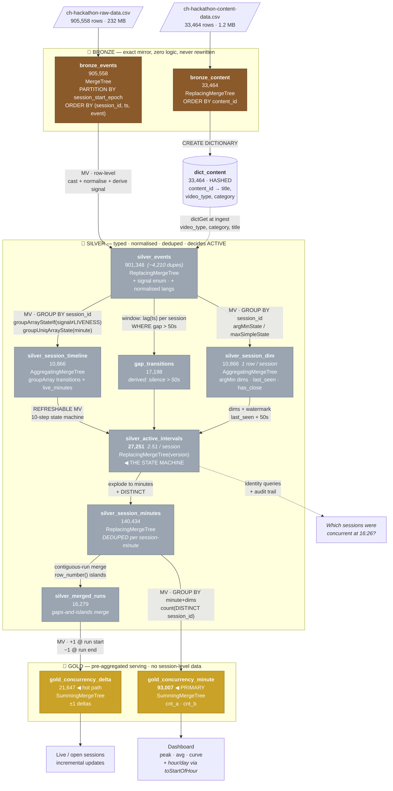

# Table & Column Catalog — Bronze → Silver → Gold

> Companion to `DESIGN.md`. Every cardinality, null count and normalisation rule below is
> **measured** from the 905,558-row source, not estimated.
>
> Rule of thumb used throughout: **`LowCardinality` pays off below ~10,000 distinct values**
> and hurts above it. Every column is judged against that line.

---

## 0. Layer contract

| Layer | Rule | Tables |
|---|---|---|
| **BRONZE** | Exact mirror of source. Zero logic. Never rewritten. | 2 |
| **SILVER** | Typed, normalised, deduped, enriched. Decides active/inactive. | 5 (+2 derived) |
| **GOLD** | Pre-aggregated serving. No session-level data. | 2 |

Everything — including deltas — is computed **at table level** via MVs. No business logic
lives in the dashboard query.

---

### 0.1 Full lineage — what reads what



### 0.2 Row-count funnel

```
 SOURCE      ch-hackathon-raw-data.csv          905,558  ████████████████████████████  100%
                        │
 🥉 BRONZE   bronze_events                      905,558  ████████████████████████████  100%
             bronze_content                      33,464  █                             3.7%
                        │  dedup (session_id, ts, event)   −4,210
 🥈 SILVER   silver_events                      901,348  ███████████████████████████   99.5%
                        │  GROUP BY session_id
             silver_session_dim                  10,866  ▏                             1.2%
             silver_session_timeline             10,866  ▏                             1.2%
                        │  filter signal≠LIVENESS  (−783,941 = 86.6%)
                        │  + gap_transitions       (+17,198)
                        │  ▼ 10-STEP STATE MACHINE
             silver_active_intervals             27,251  ▉                             3.0%
                        │  explode to minutes + DISTINCT
             silver_session_minutes             140,434  ████                          15.5%
                        │  contiguous-run merge
             silver_merged_runs                  16,279  ▌                             1.8%
                        │  GROUP BY minute + dims
 🥇 GOLD     gold_concurrency_minute             93,007  ██▉                           10.3%
             gold_concurrency_delta              21,647  ▋                             2.4%
```

### 0.3 What each layer reads and produces

| Layer | Reads from | Produces | Key transformation | Engine |
|---|---|---|---|---|
| `bronze_events` | CSV / Kafka | 905,558 | **none** — raw fidelity | `MergeTree` |
| `bronze_content` | CSV | 33,464 | **none** | `ReplacingMergeTree` |
| `dict_content` | `bronze_content` | 33,464 | in-memory hash | `DICTIONARY` |
| `silver_events` | `bronze_events` + `dict_content` | 901,348 | cast · normalise · **derive `signal`** · dedup | `ReplacingMergeTree` |
| `silver_session_dim` | `silver_events` | 10,866 | `argMin` dims · `last_seen` · `has_close` | `AggregatingMergeTree` |
| `silver_session_timeline` | `silver_events` | 10,866 | `groupArray` transitions · `groupUniqArray` minutes | `AggregatingMergeTree` |
| `gap_transitions` | `silver_events` | 17,198 | `lag(ts)` → silence > 50s | derived |
| **`silver_active_intervals`** | `…timeline` + `gap_transitions` + `…dim` | **27,251** | **10-step state machine** | `ReplacingMergeTree(version)` |
| `silver_session_minutes` | `silver_active_intervals` | 140,434 | explode + `DISTINCT` (kills +9.54% dup) | `ReplacingMergeTree` |
| `silver_merged_runs` | `silver_session_minutes` | 16,279 | gaps-and-islands merge | derived |
| **`gold_concurrency_minute`** | `silver_session_minutes` | **93,007** | `GROUP BY minute + dims` | `SummingMergeTree` |
| `gold_concurrency_delta` | `silver_merged_runs` | 21,647 | ±1 at run boundaries | `SummingMergeTree` |

### 0.4 Column-level lineage — bronze → silver → gold

```
 BRONZE COLUMN              TRANSFORM                          SILVER              GOLD
 ─────────────────────────────────────────────────────────────────────────────────────────
 video_session_id     ──►  unhex() → FixedString(32)      ──► session_id       ──►  (dropped)
 user_id              ──►  unhex() → FixedString(32)      ──► user_id          ──►  (dropped)
 content_id           ──►  toUInt32()                     ──► content_id       ──►  content_id ✓
 event_timestamp      ──►  /1000 → DateTime64(3)          ──► event_ts         ──►  minute ✓
 session_start_epoch  ──►  /1000 → DateTime64(3)          ──► session_start    ──►  (partition)
 event_type ┐                                                                  
 event      ┴─────────►  multiIf(...) 47→5                ──► signal           ──►  (consumed)
 event                ──►  LowCardinality (audit)         ──► event            ──►  (dropped)
 platform             ──►  LowCardinality                 ──► platform         ──►  platform ✓
 country              ──►  LowCardinality                 ──► country          ──►  country ✓
 audio_language       ──►  lower→split('-')[1]→unk  40→17 ──► audio_language   ──►  (optional)
 subtitle_language    ──►  same rule              10→7    ──► subtitle_lang    ──►  (optional)
 app_version          ──►  LowCardinality                 ──► app_version      ──►  (dropped)
 player_version       ──►  LowCardinality, NULL→unk       ──► player_version   ──►  (dropped)

 bronze_content.video_type ─► dictGet → Enum8('vod','live') ► video_type       ──►  video_type ✓
 bronze_content.category   ─► dictGet → LowCardinality      ► category         ──►  category ✓
 bronze_content.title      ─► dictGet → String              ► title            ──►  (dropped)

 (derived, no bronze source)
                           ──►  start/end of ACTIVE run    ──► start_ms/end_ms ──►  cnt_a / cnt_b
                           ──►  last_seen + 50s            ──► is_open         ──►  (consumed)
                           ──►  now64()                    ──► version         ──►  (consumed)
```

**Only 6 of 13 bronze columns survive to gold** as dimensions (`content_id`, `platform`,
`country`, `video_type`, `category`, `minute`). Everything else is either consumed by the
state machine or kept in silver for audit.

### 0.5 Which table answers which question

```
 "what actually arrived?"              ─────────────► bronze_events
 "is this event a state change?"       ─────────────► silver_events.signal
 "what are this session's dimensions?" ─────────────► silver_session_dim
 "is the session still alive?"         ─────────────► silver_session_dim.has_close / last_seen
 "was there a heartbeat gap?"          ─────────────► silver_session_timeline.live_minutes
 "WHEN was it active?"                 ─────────────► silver_active_intervals      ◀ truth
 "WHICH sessions at minute M?"         ─────────────► silver_active_intervals      ◀ identity
 "HOW MANY concurrent at minute M?"    ─────────────► gold_concurrency_minute      ◀ serving
 "live / open-session updates"         ─────────────► gold_concurrency_delta
 "peak & avg by hour / day"            ─────────────► gold_concurrency_minute + toStartOfHour()
```

### 0.6 Engine choice — every one maps to a problem-statement requirement

| Table | Engine | Why this engine | Requirement it serves |
|---|---|---|---|
| `bronze_events` | `MergeTree` | append-only, **keeps duplicates** — if bronze dedups you can never prove what arrived | replayability |
| `bronze_content` | `ReplacingMergeTree` | slowly-changing dim, latest wins | metadata join |
| `dict_content` | `DICTIONARY` | in-memory hash; join at **ingest**, never at query | *"real-time join with content"* |
| `silver_events` | `ReplacingMergeTree` | removes the 13 dup starts / 14 dup ends | correctness |
| `silver_session_dim` | **`AggregatingMergeTree`** | `argMin`/`max` **combine incrementally** — new heartbeat = 1 small insert, no re-read | *"update-friendly at very large scale"* |
| `silver_session_timeline` | **`AggregatingMergeTree`** | `groupArray` **accumulates across insert blocks** — the only way to give an MV whole-session context | *"absorb updates without rebuilding"* |
| `silver_active_intervals` | **`ReplacingMergeTree(version)`** | provisional close **superseded** by real close, by append | *"sessions still open whose ranges keep growing"* |
| `silver_session_minutes` | `ReplacingMergeTree` | dedups session-minute — kills the **+9.54%** double-count | correctness |
| `gold_concurrency_minute` | **`SummingMergeTree`** | counts are **additive across dimensions** (verified, 0 mismatches) so duplicate keys just fold | *"filter-friendly across dimensions"* |
| `gold_concurrency_delta` | `SummingMergeTree` | ±1 deltas fold to a net value per key | *"pre-aggregated minute deltas"* |

**The pattern:** `AggregatingMergeTree` wherever state must be *combined* incrementally,
`ReplacingMergeTree` wherever a row must be *superseded*, `SummingMergeTree` wherever values
are *additive*. Nothing anywhere requires a rebuild.

### 0.7 Update paths — what happens when new data lands

| Event | Touches | Cost |
|---|---|---|
| New heartbeat, open session | `silver_events` → `…timeline` → `…intervals` (v+1) → gold | **append only** |
| Late event for a past minute | same chain; gold aggregates absorb it | **append only** |
| `VideoSessionEnd` arrives | `…intervals` superseded by higher `version` | **append only** |
| Watermark fires (`last_seen + 50s`) | provisional close row | **append only** |
| Content metadata changes | `dict_content` reload | dictionary refresh |

**No path requires a rebuild or a rescan of bronze.** `ReplacingMergeTree` collapses
superseded rows at merge time; `SummingMergeTree` folds duplicate keys.

---

## 1. BRONZE — exactly two tables, exactly the source

Bronze mirrors the CSVs 1:1. Same column names, same order, no type narrowing, no
normalisation. If bronze is wrong, replay is impossible.

### 1.1 `bronze_events` — 905,558 rows

| # | Column | Source type | Distinct | Nulls | Bronze type | Why |
|---|---|---|---:|---:|---|---|
| 1 | `content_id` | numeric | 3,357 | 0 | `String` | keep raw; cast in silver |
| 2 | `video_session_id` | 64-char hex | 10,866 | 0 | `String` | raw fidelity |
| 3 | `user_id` | 64-char hex | 9,618 | 0 | `String` | raw fidelity |
| 4 | `event_type` | text | **7** | 0 | `String` | |
| 5 | `event` | text | **47** | 0 | `String` | |
| 6 | `event_timestamp` | epoch ms | 641,201 | 0 | `Int64` | **do not cast to DateTime in bronze** |
| 7 | `platform` | text | **10** | 0 | `String` | |
| 8 | `app_version` | text | 65 | 0 | `String` | |
| 9 | `country` | text | **1** | 0 | `String` | |
| 10 | `audio_language` | text | 40 | **1,991** | `String` | dirty — see §2.3 |
| 11 | `subtitle_language` | text | 10 | **2,006** | `String` | dirty — see §2.3 |
| 12 | `player_version` | text | 13 | **1,534** | `String` | |
| 13 | `session_start_epoch` | epoch ms | 10,848 | 0 | `Int64` | **constant per session** |

```sql
CREATE TABLE bronze_events
(
    content_id          String,
    video_session_id    String,
    user_id             String,
    event_type          String,
    event               String,
    event_timestamp     Int64,
    platform            String,
    app_version         String,
    country             String,
    audio_language      Nullable(String),
    subtitle_language   Nullable(String),
    player_version      Nullable(String),
    session_start_epoch Int64,
    _ingested_at        DateTime64(3) DEFAULT now64(3),
    _partition          Int32  DEFAULT 0,
    _offset             Int64  DEFAULT 0,
    _raw                String DEFAULT ''
)
ENGINE = MergeTree
PARTITION BY toYYYYMMDD(toDateTime(intDiv(session_start_epoch, 1000)))
ORDER BY (video_session_id, event_timestamp, event);
```

> **`PARTITION BY session_start_epoch`, not event date.** Verified: `session_start_epoch` is
> **constant across every row of every session**. Partitioning on it co-locates a session's
> entire history in one partition — including the 16 sessions that span multiple calendar
> days (max 43 hrs). Partition by event date and those sessions shatter.

> **Plain `MergeTree`, not `ReplacingMergeTree`.** Bronze keeps duplicates. Dedup is silver's
> job; if bronze dedups, you can never prove what actually arrived.

### 1.2 `bronze_content` — 33,464 rows

| Column | Distinct | Nulls | Type | Note |
|---|---:|---:|---|---|
| `content_id` | 33,464 | 0 | `String` | unique — true primary key |
| `title` | 30,508 | 0 | `String` | 2,956 duplicate titles |
| `video_type` | **2** | 0 | `String` | **only `live` / `vod`** |
| `category` | 84 | 0 | `String` | |

```sql
CREATE TABLE bronze_content
(
    content_id String,
    title      String,
    video_type String,
    category   String,
    _loaded_at DateTime DEFAULT now()
)
ENGINE = ReplacingMergeTree(_loaded_at)
ORDER BY content_id;
```

**Join coverage: 100%.** All 3,357 event `content_id`s exist in the content table — a
`LEFT JOIN` is safe, but assert the count anyway.

---

## 2. Column decisions — cardinality drives everything

### 2.1 The cardinality ladder

```
  1  country              ▏                    ← degenerate, keep for schema stability
  2  video_type           ▏                    ← live / vod. THE dimension for this problem
  7  event_type           ▏
 10  platform             ▏
 10  subtitle_language    ▏
 13  player_version       ▏
 40  audio_language       ▎                    ← 17 after normalisation
 47  event                ▎
 65  app_version          ▎
 84  category             ▍
────────────────────────── LowCardinality clearly wins ──────────────────────────
 3,357  content_id (in events)      ██
 9,618  user_id                     ████
10,866  video_session_id            █████
────────────────────────── LowCardinality breaks even ~10K ──────────────────────
33,464  content_id (catalog)        ███████████
```

### 2.2 Type recommendation per column

| Column | Distinct | **Silver type** | Bytes/row | vs `String` | Reasoning |
|---|---:|---|---:|---:|---|
| `country` | 1 | `LowCardinality(String)` | ~1 | 5x | degenerate today, may grow |
| `video_type` | 2 | `Enum8('vod'=1,'live'=2)` | **1** | 4x | closed set, never grows |
| `event_type` | 7 | `Enum8` | **1** | 17x | closed set |
| `platform` | 10 | `LowCardinality(String)` | ~1 | 17x | may add devices — not `Enum` |
| `subtitle_language` | 7* | `LowCardinality(String)` | ~1 | 11x | *after normalisation |
| `player_version` | 13 | `LowCardinality(String)` | ~1 | 32x | |
| `audio_language` | 17* | `LowCardinality(String)` | ~1 | 13x | *after normalisation |
| `event` | 47 | `LowCardinality(String)` | ~1 | 24x | keep raw for audit |
| `app_version` | 65 | `LowCardinality(String)` | ~1 | 9x | |
| `category` | 84 | `LowCardinality(String)` | ~1 | 5x | |
| `signal` | 5 | `Enum8` | **1** | — | derived (§2.4) |
| `content_id` | 3,357 / 33,464 | **`UInt32`** | 4 | 2.5x | max = 2,078,177,474 — fits |
| `video_session_id` | 10,866 | **`UInt128`** (hash) | 16 | **4x** | 64-char hex → see §2.5 |
| `user_id` | 9,618 | **`UInt128`** (hash) | 16 | **4x** | 64-char hex |
| `event_timestamp` | 641,201 | `DateTime64(3)` | 8 | — | ms precision required |
| `session_start_epoch` | 10,848 | `DateTime64(3)` | 8 | — | partition key |
| `title` | 30,508 | `String` | var | — | **do not** LowCardinality |

> **`Enum8` vs `LowCardinality`:** use `Enum8` only for genuinely closed sets
> (`video_type`, `event_type`, `signal`). An unseen-day value not in the `Enum` **throws**.
> `platform` and `event` use `LowCardinality` because a new device or telemetry event on the
> unseen day must not break ingestion.

### 2.3 Normalisation rules — the dirty columns

**`audio_language` is the worst column in the dataset.** 40 raw values collapse to 17:

| Step | Distinct | Removes |
|---|---:|---|
| raw | **40** | — |
| `lower()` | 25 | `HIN`/`hin`, `MAL`/`mal`, `ENG`/`eng` … |
| `splitByChar('-')[1]` | 18 | `hin-hindi`→`hin`, `eng-English`→`eng`, `-soundhandler`→`` |
| `coalesce(nullif(…,''),'unk')` | **17** | 1,991 NULLs |

```sql
coalesce(nullif(splitByChar('-', lower(assumeNotNull(audio_language)))[1], ''), 'unk')
```

Same rule collapses `subtitle_language` **10 → 7** (`UND`/`und`, `OFF`/`off`, `UNK`/`unk`).

> **Known residue:** `jap` (1,374) and `jpn` (386) are both Japanese and the rule does *not*
> merge them. Needs an explicit alias map. Left unmerged deliberately — flagged rather than
> silently guessed.

**NULL policy** — never leave a dimension nullable in silver; `Nullable` costs a byte per row
and breaks `LowCardinality` compression:

| Column | Nulls | Replace with |
|---|---:|---|
| `audio_language` | 1,991 | `'unk'` |
| `subtitle_language` | 2,006 | `'unk'` |
| `player_version` | 1,534 | `'unk'` |

### 2.4 Derived columns — computed once in silver, never at query time

| Column | Type | Rule | Cardinality |
|---|---|---|---:|
| `signal` | `Enum8` | §3.4 of `DESIGN.md` | **5** |
| `is_state` | `UInt8` | `signal != 'LIVENESS'` | 2 |
| `event_minute` | `DateTime` | `toStartOfMinute(event_ts)` | 3,686 |
| `video_type` | `Enum8` | `dictGet(dict_content,'video_type',content_id)` | 2 |
| `category` | `LowCardinality` | `dictGet(...)` | 84 |

```sql
signal Enum8('LIVENESS'=0,'STATE_ACTIVE'=1,'STATE_INACTIVE'=2,'SESSION_OPEN'=3,'SESSION_CLOSE'=4)
```

Distribution: `LIVENESS` 783,941 (86.6%) · `STATE_ACTIVE` 57,391 (6.3%) ·
`STATE_INACTIVE` 42,465 (4.7%) · `SESSION_CLOSE` 10,881 · `SESSION_OPEN` 10,880.

### 2.5 The ID columns — 4x win, with a caveat

`video_session_id` and `user_id` are **verified 100% uppercase 64-char hex**. As `String`
that's 64 bytes + length; as `UInt128` it's 16.

```sql
reinterpretAsUInt128(unhex(video_session_id))   -- lossless for 32 hex chars
```

> ⚠ **64 hex chars = 256 bits, which does not fit in `UInt128`.** Options:
> **(a)** `FixedString(32)` via `unhex()` — fully lossless, 32 bytes, 2x saving;
> **(b)** `cityHash64()` → `UInt64`, 8 bytes, 8x saving, ~0 collision risk at 10K–10M sessions.
>
> **Recommendation: `FixedString(32)`.** Lossless, still 2x, and keeps the join to bronze
> exact. Use the hash only if profiling shows the ID column dominates.

---

## 3. SILVER — five tables

```
 bronze_events ──┬─► S1 silver_events        (typed, normalised, deduped, enriched)
                 │        │
 bronze_content ─┘        ├─► S2 silver_session_dim       (1 row / session)
   (DICTIONARY)           ├─► S3 silver_session_timeline  (arrays / session)
                          │        │
                          │        └─► S4 silver_active_intervals  ◀ THE STATE MACHINE
                          │                   │
                          └───────────────────┴─► S5 silver_session_minutes
```

### S1 · `silver_events` — 901,348 rows

Row-level transform only ⇒ a plain incremental MV works.

| Column | Type | Cardinality | Role |
|---|---|---:|---|
| `session_id` | `FixedString(32)` | 10,866 | key |
| `user_id` | `FixedString(32)` | 9,618 | dim |
| `content_id` | `UInt32` | 3,357 | dim |
| `event_ts` | `DateTime64(3)` | 641,201 | time |
| `session_start` | `DateTime64(3)` | 10,848 | partition |
| `signal` | `Enum8` | 5 | **state machine input** |
| `event` | `LowCardinality(String)` | 47 | audit |
| `event_type` | `Enum8` | 7 | audit |
| `platform` | `LowCardinality(String)` | 10 | dim |
| `country` | `LowCardinality(String)` | 1 | dim |
| `video_type` | `Enum8` | 2 | dim (from dict) |
| `category` | `LowCardinality(String)` | 84 | dim (from dict) |
| `audio_language` | `LowCardinality(String)` | 17 | dim (normalised) |
| `subtitle_language` | `LowCardinality(String)` | 7 | dim (normalised) |
| `app_version` | `LowCardinality(String)` | 65 | dim |
| `player_version` | `LowCardinality(String)` | 13 | dim |

```sql
ENGINE = ReplacingMergeTree
PARTITION BY toYYYYMMDD(session_start)
ORDER BY (session_id, event_ts, event, signal);
```

**Dedup key = `(session_id, event_ts, event)`** — removes the 13 duplicate `VideoSessionStart`
and 14 duplicate `VideoSessionEnd` rows.

### S2 · `silver_session_dim` — 10,866 rows · one row per session

#### What problem does it solve?

The problem statement asks: *"How does the model stay **filter-friendly** across platform,
country, content, video type?"* — and separately, *"How do you handle sessions that are
**still open**?"*

Both questions need the same thing: **a per-session summary that updates incrementally.**

**Problem 1 — dimensions live on events, not on sessions.** Every one of the 905,558 event
rows carries its own `platform`, `country`, `content_id`. But concurrency is counted *per
session*, so a session must be attributed to exactly **one** dimension tuple. The data does
not cooperate:

| Anomaly | Sessions | % of total |
|---|---:|---:|
| Sessions carrying >1 `platform` | 95 | 0.87% |
| Sessions carrying >1 `user_id` | 120 | 1.10% |
| Sessions carrying >1 `content_id` | 1 | 0.01% |

If a session appears under two platforms it gets counted **twice** and dimension additivity
collapses. `argMin(dim, event_ts)` pins each session to its *first* observed value.

**The volumes are small enough to be noise** (see the impact analysis below) — the pinning
matters for **reproducibility**, not accuracy.

> This is precisely what makes the verified property in §G1 hold: rolling the gold table up
> across dimensions gives **0 mismatches over 10,409 cells**. Without pinning, it wouldn't.

**Problem 2 — the watermark needs `last_seen`.** To close an open session you need
`max(event_ts)` per session, continuously updated as heartbeats arrive. Computing that by
scanning bronze on every query is exactly the "recomputing from raw session history" the
problem statement rules out.

#### Column purposes

| Column | Aggregation | Answers |
|---|---|---|
| `platform` `country` `content_id` `video_type` | `argMinState(dim, event_ts)` | *which dimension cell does this session belong to?* |
| `user_id` | `argMinState(user_id, event_ts)` | user-level concurrency |
| `session_start` | `minSimpleState(event_ts)` | partition routing |
| **`last_seen`** | `maxSimpleState(event_ts)` | **watermark: is it still alive?** |
| **`has_close`** | `maxSimpleState(signal='SESSION_CLOSE')` | **open vs closed** |
| `n_events` | `countState()` | QA / anomaly detection |

#### Why `AggregatingMergeTree`?

```
 new heartbeat arrives  ──►  INSERT one partial-state row  ──►  merge folds it in
                                     ↓
                        last_seen updates WITHOUT re-reading the session's history
```

`AggregatingMergeTree` stores *partial aggregate states* and combines them at merge time. A
new event for a session already seen a million times costs **one small insert** — the engine
does the `max`/`argMin` combination during background merges.

The alternatives all fail the problem statement's "update-friendly at very large scale" bar:

| Alternative | Why it fails |
|---|---|
| `MergeTree` + `GROUP BY` at query time | re-aggregates all events per query — the thing we're avoiding |
| `ReplacingMergeTree` | replaces whole rows; can't *combine* `max`/`argMin` across inserts |
| `SummingMergeTree` | only sums; can't express `argMin` or `max` |
| External store (Redis) | breaks "ClickHouse is the primary datastore" |

#### What `argMin(dim, event_ts)` actually means

`argMin(a, b)` = **"return the value of `a` from the row where `b` is smallest."**

| Argument | Here | Meaning |
|---|---|---|
| `a` — the value you want back | `platform`, `country`, `content_id` … | the dimension to keep |
| `b` — the value you rank by | `event_ts` | the session's earliest event |

So `argMin(platform, event_ts)` = **the platform recorded on the session's first event.**
It never compares platforms to each other — it finds the minimum *timestamp*, then returns
whatever `platform` sat on that row.

Real session `035FAF49…F1EE` from the dataset:

```
  ts         event_type          platform
 ─────────────────────────────────────────────
  16:54:00   VideoSessionStart   ANDROID_TAB     ◀ earliest → argMin returns THIS
  16:54:02   VideoPlay           ANDROID_PHONE
  16:54:03   VideoHeartbeat      ANDROID_PHONE
  16:54:08   AppBackgrounded     ANDROID_PHONE
```

| Function | Returns | Correct? |
|---|---|---|
| **`argMin(platform, event_ts)`** | **`ANDROID_TAB`** | ✅ the platform at session start |
| `argMax(platform, event_ts)` | `ANDROID_PHONE` | defensible (last seen), but arbitrary |
| `min(platform)` | `ANDROID_PHONE` | ❌ **alphabetical order of the string** — meaningless |
| `any(platform)` | either | ❌ **non-deterministic** |

`min(platform)` is the trap: it looks similar but sorts the *string*. It disagrees with
`argMin` on **55 sessions**.

#### How much does this actually matter? Honestly: very little

| | |
|---|---:|
| Sessions with >1 platform | **95 of 10,866 (0.87%)** |
| Worst case (all mis-bucketed into one platform) | 3.2% of peak |
| Realistic (spread across 10 platforms) | **~0.3%** |

**This is noise-level, and you could reasonably ignore the anomaly itself.** These 95 sessions
are almost certainly synthetic-data artifacts, not a real product behaviour worth modelling.

> **The reason to use `argMin` is not accuracy — it's determinism, and it costs nothing.**
>
> `any()` picks whichever row the merge happened to see first. That value can **change between
> runs** as parts merge in different orders. The peak would wobble by a few sessions on
> re-execution, benchmark answers would not reproduce, and a judge re-running your query would
> get a different number than your submission. That is a credibility problem, not a
> correctness one — and it is entirely avoidable for zero extra cost, since `argMin` and
> `any` are both single-pass aggregates.
>
> **Rule: prefer the deterministic aggregate whenever it's free, regardless of whether the
> underlying anomaly matters.**

---

### S3 · `silver_session_timeline` — 10,866 rows · one row per session

#### What problem does it solve?

**This table exists because of a hard ClickHouse constraint:**

> A materialized view only sees **the rows in the block currently being inserted**. It cannot
> look back at rows inserted earlier.

But the state machine is inherently sequential — to know whether a `resume` follows a `pause`,
or whether a 60-second silence is a gap, you need the session's **whole ordered history**. A
plain MV cannot do this. And re-reading bronze per session on every heartbeat is exactly what
the problem statement calls "far too slow."

`AggregatingMergeTree` + `groupArray` resolves it: **the array accumulates across blocks and
merges.** Each session's full history is assembled incrementally, in one row, without ever
re-scanning bronze.

```
 block 1: [start, play]              ──┐
 block 2: [pause, background]        ──┼──► groupArrayState merges ──► [start,play,pause,bg,fg,end]
 block 3: [foreground, end]          ──┘                                    ↑
                                              the state machine reads THIS, not bronze
```

#### Why two arrays, not one?

| Column | Aggregation | Rows/session | Purpose |
|---|---|---:|---|
| `transitions` | `groupArrayStateIf((event_ts, signal), signal != 'LIVENESS')` | **11.2** | ordered state changes — drives the state machine |
| `live_minutes` | `groupUniqArrayState(minute)` | **12.3** | proof-of-life — drives gap detection |

They answer different questions and compress differently:

**`transitions` — the *sequence* matters.** Order and exact timestamp are load-bearing. Filter
drops 86.6% of rows (783,941 LIVENESS events) because they never change state.

**`live_minutes` — only *presence* matters.** For gap detection you don't need every
heartbeat, just whether *any* event landed in a minute. `groupUniqArray` collapses
**783,941 → 133,296 (5.9x)** and, crucially, bounds memory by **session duration** rather than
by chattiness. The 1,803-event session contributes at most `duration_in_minutes` entries.

> Without the second array, a chatty session's array grows without bound. With it, memory per
> session is bounded by wallclock — the property that makes this survive at 100x.

#### Why is this separate from `silver_session_dim`?

They *could* be one table. They are separate because:

| | `session_dim` | `session_timeline` |
|---|---|---|
| Shape | scalars | arrays (~23 elements) |
| Merge cost | cheap (`max`, `argMin`) | expensive (`groupArray` concat) |
| Read by | interval builder, identity queries, watermark checks | **only** the state machine |
| Refresh cadence | every insert | refreshable MV cadence |

Keeping the cheap scalars separate lets the **watermark check run continuously** without
touching the expensive arrays. That matters directly for *"sessions still open whose active
ranges keep growing"* — you poll `last_seen` constantly and rebuild intervals only for
sessions that actually moved.

#### Together: dim = *what*, timeline = *when in what order*

```
 silver_session_dim        "session X is ANDROID_PHONE / india / vod / content 21058030,
                            last seen 16:27:59, has_close = 1"
                                                   │
 silver_session_timeline   "session X went: OPEN@16:19:45 → INACTIVE@16:21:05
                            → ACTIVE@16:25:04 → CLOSE@16:27:59
                            and was alive in minutes {16:19..16:21, 16:25..16:27}"
                                                   │
                                                   ▼
 silver_active_intervals   [16:19:45 → 16:21:05)  ANDROID_PHONE / vod / 21058030
                           [16:25:04 → 16:27:59)  ANDROID_PHONE / vod / 21058030
```

The state machine needs **both**: the sequence to compute *when*, the dims to label *what*.

---

### S4 · `silver_active_intervals` — 27,251 rows (`FG`) ◀ the state machine

All conditions applied here. Populated by a **refreshable MV** (needs whole-session context),
processing only sessions whose `last_seen` moved since the last refresh.

| Column | Type | Note |
|---|---|---|
| `session_id` | `FixedString(32)` | |
| `defn` | `Enum8('FG'=1,'ENG'=2)` | **`FG` = primary (pause ACTIVE) · `ENG` = engagement diagnostic** |
| `start_ms` / `end_ms` | `DateTime64(3)` | |
| `platform` / `country` / `video_type` / `content_id` / `category` | dims | denormalised |
| `is_open` | `UInt8` | 1 = provisional close at watermark |
| `close_reason` | `Enum8('END','WATERMARK','BACKGROUND','PAUSE','GAP')` | audit |
| `version` | `UInt64` | supersede on real close |

```sql
ENGINE = ReplacingMergeTree(version)
PARTITION BY toYYYYMMDD(start_ms)
ORDER BY (session_id, defn, start_ms);
```

**The complete condition set:**

| # | Condition | Trigger | Effect under `FG` |
|---|---|---|---|
| 1 | Session opens | `SESSION_OPEN` | → ACTIVE |
| 2 | Session closes | `SESSION_CLOSE` | terminal |
| 3 | **Backgrounded** | `AppBackgrounded` | **→ INACTIVE (−915 hrs)** |
| 4 | Foregrounded | `AppForegrounded` | → ACTIVE |
| 5 | **Heartbeat gap > 50s** | gap in `live_minutes` | **→ INACTIVE** |
| 6 | Heartbeat returns | gap closes | → ACTIVE |
| 7 | **Idempotency** | drop transition == previous | prevents cumsum drift |
| 8 | Watermark close | `last_seen + 50s`, no `SESSION_CLOSE` | provisional close |
| — | `pause` / `resume` | | **NO CHANGE — stays ACTIVE** |
| — | `BufferStart` / `BufferEnd` | | **NO CHANGE — stays ACTIVE** |
| — | `speed-*`, `Ad*`, `Seek` | | **NO CHANGE** |

> **Only two things end presence: background and silence.** A paused or buffering viewer still
> holds a player slot, a CDN connection and an ad-impression opportunity — they are concurrent.

| `defn` | `pause` | Excludes | Intervals | Active hrs | **Peak** | **Avg** |
|---|---|---|---:|---:|---:|---:|
| **`FG` (primary)** | **ACTIVE** | background, silence | 27,251 | **2,007.8** | **2,958** | **36.2** |
| `ENG` (diagnostic) | inactive | + pause | 37,545 | 1,857.2 | 2,844 | 35.3 |

> Condition 7 is one `arrayFilter` line and it is **not optional** — 109 `BG→BG` and 45
> `FG→FG` pairs produce unbalanced deltas, and because concurrency is a cumulative sum, one
> unbalanced delta corrupts **every subsequent minute permanently**.

### S5 · `silver_session_minutes` — 140,434 rows (`FG`)

Explodes each interval to the minutes it covers, **deduplicated per session-minute**.

| Column | Type |
|---|---|
| `minute` | `DateTime` |
| `session_id` | `FixedString(32)` |
| `defn` | `Enum8` |
| `covers_boundary` | `UInt8` — Definition A |
| `covers_any` | `UInt8` — Definition B |
| dims | denormalised |

```sql
ENGINE = ReplacingMergeTree
ORDER BY (minute, defn, session_id);
```

> **This table exists solely to kill the 9.54% double-count bug.** A session can hold two
> active intervals inside one minute (pause + resume within 60s). Without dedup here:
> 149,992 session-minutes instead of **136,924** — a **+9.54%** inflation.

---

## 4. GOLD — two tables

### G1 · `gold_concurrency_minute` — 93,007 rows (`FG`) ◀ primary serving table

**The measurement that changes the design.** Aggregating the exploded minutes to
`(minute × dimensions)` collapses them almost completely:

```
 session-minutes exploded    136,924
 → aggregated to full grain   90,511   ◀ only 1.26x the delta table (71,908)
```

The problem statement warns that per-minute explosion is "prohibitively large." **That is true
for per-session-per-minute rows, and false once you aggregate to dimension grain.** Measured:
**24.6 dimension-combos active per minute** on average, 1.51 sessions per cell.

| Column | Type | Cardinality |
|---|---|---:|
| `minute` | `DateTime` | 3,686 |
| `platform` | `LowCardinality(String)` | 10 |
| `country` | `LowCardinality(String)` | 1 |
| `video_type` | `Enum8` | 2 |
| `content_id` | `UInt32` | 3,357 |
| `defn` | `Enum8` | 2 |
| `cnt_a` | `SimpleAggregateFunction(sum, UInt32)` | Definition A |
| `cnt_b` | `SimpleAggregateFunction(sum, UInt32)` | Definition B |

```sql
ENGINE = SummingMergeTree
PARTITION BY toYYYYMM(minute)
ORDER BY (defn, country, video_type, platform, content_id, minute);
```

> **✅ Verified property: counts are perfectly additive across dimensions.** Rolling the
> full-grain table up to `(minute, platform)` and comparing against a direct
> `(minute, platform)` count over 5,110 rows gives **0 mismatches, max diff 0**.
>
> This holds because each session is pinned (S2) to exactly **one** `(platform, country,
> video_type, content_id)` tuple — the dimension tuple *partitions* the session set.
>
> **Therefore: `SUM` across dimensions ✅ · `SUM` across time ❌ (use `MAX`/`AVG`).**

This is what makes the whole thing work: **no cumulative sum at query time.** Peak and average
become plain aggregates, which removes three failure modes at once — the filter-before-cumsum
trap, the `WITH FILL` gap problem, and negative-drift from unbalanced deltas.

```sql
-- peak + average, any filter, any grain. No window function.
SELECT max(c) AS peak, avg(c) AS avg_conc, argMax(minute, c) AS peak_minute
FROM (
    SELECT minute, sum(cnt_b) AS c
    FROM gold_concurrency_minute
    WHERE defn = 'FG' AND minute BETWEEN {from} AND {to} AND platform = {p}
    GROUP BY minute
);
```

### G2 · `gold_concurrency_delta` — 21,647 rows (`FG`)

Kept **alongside** G1, not instead of it. Deltas are update-friendly; counts are query-friendly.

| Column | Type |
|---|---|
| `minute`, dims, `defn` | as G1 |
| `delta_a` / `delta_b` | `SimpleAggregateFunction(sum, Int32)` |

```sql
ENGINE = SummingMergeTree
ORDER BY (defn, country, video_type, platform, content_id, minute);
```

| | G1 counts | G2 deltas |
|---|---|---|
| Rows | 90,511 | 71,908 |
| Write cost per interval | O(duration in minutes) | **O(1)** — 2 rows |
| Query | `max`/`avg` — trivial | needs cumsum + `WITH FILL` |
| Extending an open session | rewrite minute range | **append one row** |
| Correcting an end time | delete + reinsert | **one `−1` moves** |

**Tiering:** G2 serves the hot window (open sessions, last N minutes); G1 serves finalised
history once the watermark passes. That is the "hybrid tiering / incremental compaction" the
problem statement asks for.

### ❌ Why there is NO `gold_concurrency_hour` table

An hour/day rollup table looks obviously useful. **It is a correctness trap, and we measured it.**

To store an hour table you must pick a grain — say `(hour, platform, content_id)` — and store
`max(concurrency)` in each cell. The moment anyone asks for a *coarser* slice
(`hour + platform`, dropping content), the stored maxima cannot be recombined:

```
 ✗ rolled  = Σ over content of ( max over minutes )     ← peaks that never co-occurred
 ✓ truth   = max over minutes of ( Σ over content )     ← sum to grain FIRST, then max
```

Measured on this dataset, `(hour, platform)` from stored `(hour, platform, content)` maxima:

| Cells | Wrong | % wrong | Avg error | Max overstatement |
|---:|---:|---:|---:|---:|
| 163 | **93** | **57.1%** | **+96.7%** | **+931 sessions** |

**More than half the cells are wrong and the average answer is nearly double.** This is the
same non-additivity as §6.2 of `DESIGN.md`, one level up: `max` never decomposes.

**And it buys nothing.** Hour and day grain come straight off the minute table:

```sql
SELECT toStartOfHour(minute) AS hour, max(c) AS peak, avg(c) AS avg_conc
FROM (
    SELECT minute, sum(cnt_b) AS c
    FROM gold_concurrency_minute
    WHERE defn = 'FG' AND minute BETWEEN {from} AND {to} AND platform = {p}
    GROUP BY minute)
GROUP BY hour;
```

That reads ~9,400 rows for a filtered query and returns in milliseconds. A precomputed hour
table would save no measurable time, add a maintenance path, and be wrong 57% of the time.

> **Rule: pre-aggregate only `SUM`-like measures. Never pre-aggregate `MAX`.**
> `cnt` is summable across dimensions (verified, 0 mismatches). `peak` is not summable across
> anything. Store the summable thing; derive the rest.

---

## 5. Size ledger

| Layer | Table | Rows | vs bronze |
|---|---|---:|---:|
| 🥉 | `bronze_events` | 905,558 | 100% |
| 🥉 | `bronze_content` | 33,464 | 3.7% |
| 🥈 | `silver_events` | 901,348 | 99.5% |
| 🥈 | `silver_session_dim` | 10,866 | 1.2% |
| 🥈 | `silver_session_timeline` | 10,866 | 1.2% |
| 🥈 | **`silver_active_intervals`** | **27,251** | **3.0%** |
| 🥈 | `silver_session_minutes` | 140,434 | 15.5% |
| 🥈 | `silver_merged_runs` | 16,279 | 1.8% |
| 🥇 | **`gold_concurrency_minute`** | **93,007** | **10.3%** |
| 🥇 | `gold_concurrency_delta` | 21,647 | 2.4% |

**Serving layer is 10.3% of raw**, and it grows with *minutes × observed dimension combos* —
not with session count. Ten million sessions in one minute still produce ~25 rows.

---

## 6. Open items

1. **`jap` / `jpn` alias** — both Japanese, 1,760 rows, not merged by the normalisation rule.
2. **`FixedString(32)` vs `cityHash64`** for IDs — 2x vs 8x saving; recommend lossless.
3. **50-second gap threshold — empirically derived**, not guessed: the gap histogram
   collapses 137x at 50s, and P(gap contains a real `AppBackgrounded`) jumps 0.5% → 50.6% at
   the same point. Sensitivity across 45s→180s is **0.6%**.
4. **`defn` doubles every silver/gold row.** `ENG` is a diagnostic; drop it to reclaim 2x if
   engagement reporting isn't needed.
5. **`country` has 1 value.** Keep in the ordering key for schema stability; it costs ~nothing
   under `LowCardinality` and avoids a migration if the unseen day adds markets.
